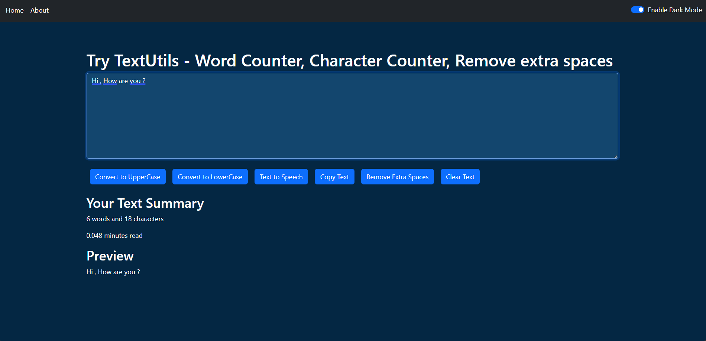

# 📝 TextUtils  

A React-based text utility app that helps you analyze and modify your text with ease.  

🔗 **Live Demo:** [TextUtils on Netlify](https://textsutils-reactapp.netlify.app/)  

---

## 🚀 Features  

- 🔤 Convert text to **UPPERCASE** and **lowercase**  
- 🧹 Remove **extra spaces**  
- 📋 Copy text to clipboard  
- 🔢 Count **words and characters**  
- ⏱️ Estimate **reading time**  
- 🌓 Dark Mode / Light Mode toggle  
- 🔊 Text-to-Speech support  

---

## 🛠️ Tech Stack  

- ⚛️ **React.js** – UI and components  
- 🎨 **Bootstrap / CSS** – Styling  
- 🌐 **Netlify** – Deployment  

---

## 📸 Screenshots  


|  |
 

---

## ⚡ Getting Started  

Follow these steps to run the project locally:  

1. Clone the Repository  
```bash
git clone https://github.com/your-username/textutils.git
```
 
2️⃣ Move into the Project Folder
   cd textutils

3️⃣ Install Dependencies
  npm install


4️⃣ Start the Development Server
  npm start


## Project Structure 
textutils/
│── public/          # Static files  
│── src/             # React components  
│   │── components/  # Navbar, TextForm, Alerts, etc.  
│   │── App.js       # Main app logic  
│   │── index.js     # Entry point  
│── package.json     # Project metadata & dependencies  

📌 Future Improvements
🌍 Add support for multiple languages
📱 Make UI more mobile-friendly
🎙️ Improve Text-to-Speech voice options

👨‍💻 Author
Himanshu Shekhar